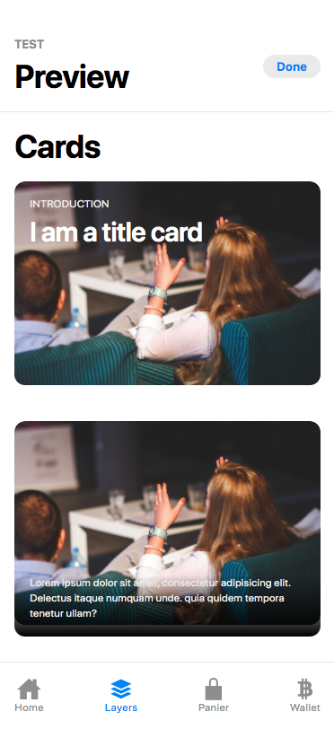
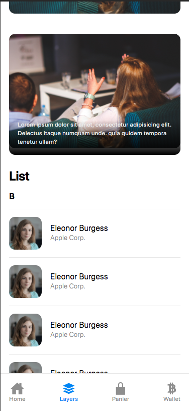

# [in development] CSS Library based on iOS 13 design

This is free iOS based UI ressources written in SCSS. 
It's like Bootstrap but inspired by Apple's design.

## Screenshots

## Disclaimer

I'm not the designer, the design was made by Apple Corp. I just integrated this to provide free UI Ressources.